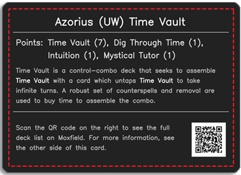
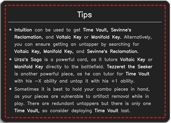

# MTG-Primer-Blurb

A program designed to create high resolution images to act as deck primers for decks in the Canadian Highlander format of the card game Magic: The Gathering. The images are designed to be use in conjunction with makeplayingcards.com in order to have custom cards which are stylish, portable, and informative.

For instructions on using and setting up this program, see [the instructions PDF](./MTG-Automated-Primers-Instructions.pdf).

Below is an example primer card created using this program.

| Digital Version Front | Digital Version Back |
| :--: | :---: |
|  |  |

The images are designed to lie horizontally on the physical cards.

| Physical Version Front | Physical Version Back |
| :--: | :---: |
|  |  |

The text boxes are designed to lie comfortably within MakePlayingCards cut lines.

| Cut Lines Version Front | Cut Lines Version Back |
| :--: | :---: |
|  |  |
